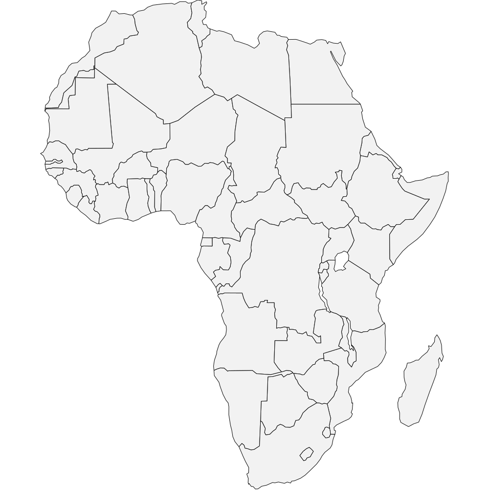
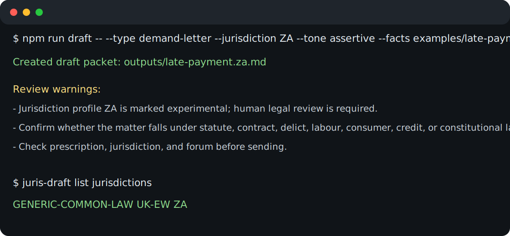
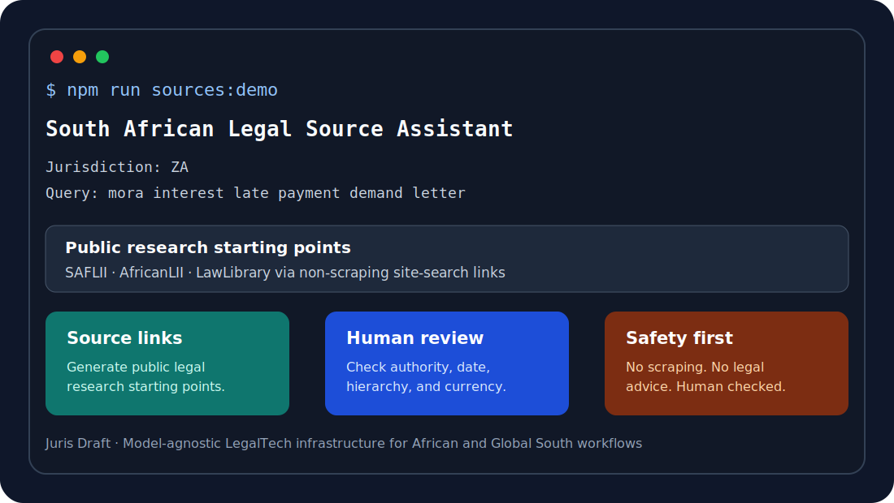
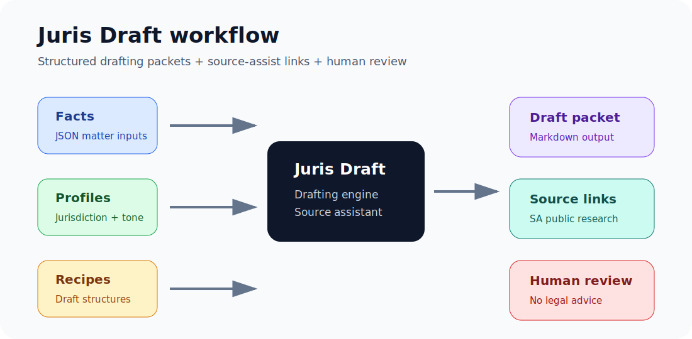
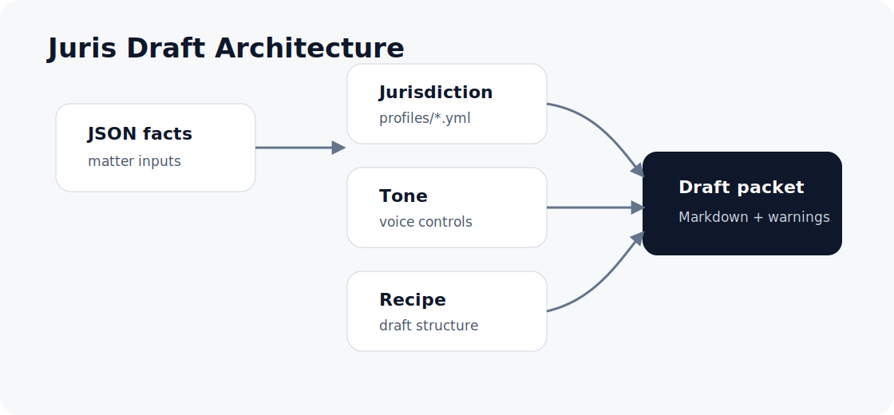

# Juris Draft

<table>
<tr>
<td width="58%" valign="middle">

## Open LegalTech for African and Global South contexts

**Model-agnostic · jurisdiction-aware · human-review-first**

Juris Draft starts from South African LegalTech needs while remaining adaptable across jurisdictions. It supports structured drafting packets, public legal source-assist workflows, and human review in under-resourced or jurisdictionally complex environments.

**Core themes:** localisation · access · legal source checking · responsible human review

</td>
<td width="42%" align="center" valign="middle">
  
  <br>
  <sub>South Africa is the starting jurisdiction for the source-assist workflow.</sub>
</td>
</tr>
</table>


**Model-agnostic legal drafting infrastructure for jurisdiction-aware, tone-controlled first drafts.**

Juris Draft helps lawyers, legal technologists, law students, and access-to-justice builders create structured drafting packets using explicit jurisdiction, tone, document type, and human-review controls.

> Juris Draft is not a lawyer and does not provide legal advice. It produces structured first drafts and drafting packets for human review by qualified professionals.



## Why model-agnostic?

Most legal drafting tools are thin wrappers around a single AI provider. Juris Draft keeps the core drafting structure separate from any model. The framework works with profiles, recipes, and facts first. Model providers can be added later as optional adapters, without making the project dependent on one API or vendor.

## Features

| Feature | Status |
| --- | --- |
| CLI draft generation | MVP |
| Jurisdiction profiles | MVP |
| Tone profiles | MVP |
| Markdown recipe templates | MVP |
| JSON fact inputs | MVP |
| Markdown outputs | MVP |
| Human-review warnings | MVP |
| Tests and GitHub Actions | MVP |
| DOCX export | Planned |
| Optional model adapters | Planned |

## South African Legal Source Assistant

Juris Draft includes a non-scraping South African legal source assistant for public legal research workflows.

The source assistant generates research links for public legal-information sources and adds a human-review checklist for checking court hierarchy, date, authority, source currency, and legal-advice limitations. It does not fetch, scrape, summarise, or verify legal sources automatically.

<p align="center">
  
</p>

Example command:

    npm run sources:demo

Or write to a file:

    npm run sources -- --jurisdiction ZA --query "mora interest late payment demand letter" --output outputs/za-legal-source-assistant.md

The current source assistant supports South Africa (ZA) and links to public research starting points for SAFLII, AfricanLII, and LawLibrary through non-scraping site-search links.

## Quick start

```bash
npm install
npm run build
npm run draft -- --type demand-letter --jurisdiction ZA --tone assertive --facts examples/late-payment.za.json --output outputs/late-payment.za.md
```

List available profiles:

```bash
npm run dev -- list jurisdictions
npm run dev -- list tones
npm run dev -- list recipes
```

## Example command

```bash
npm run draft -- \
  --type demand-letter \
  --jurisdiction ZA \
  --tone assertive \
  --facts examples/late-payment.za.json \
  --output outputs/late-payment.za.md
```

<p align="center">
  
</p>

## Architecture



Juris Draft combines four inputs:

1. **Facts**: matter-specific inputs in JSON.
2. **Jurisdiction profile**: terminology, drafting conventions, risk flags, and disclaimers.
3. **Tone profile**: voice rules and language to avoid.
4. **Recipe**: document-specific drafting structure.

The output is a Markdown drafting packet with warnings and review notes.

## Supported MVP profiles

### Jurisdictions

- `ZA` — South Africa, experimental
- `UK-EW` — England and Wales, experimental
- `GENERIC-COMMON-LAW` — generic fallback, stub

### Tones

- `formal`
- `plain-english`
- `assertive`
- `conciliatory`
- `client-friendly`

### Recipes

- `demand-letter`
- `nda-outline`
- `settlement-proposal`
- `clause-redraft`

## Example facts file

```json
{
  "title": "Late Payment Demand Letter - ExampleCo v Sample Retail",
  "parties": [
    { "name": "ExampleCo (Pty) Ltd", "role": "Creditor / service provider" },
    { "name": "Sample Retail CC", "role": "Debtor / customer" }
  ],
  "background": "ExampleCo supplied software implementation services to Sample Retail under a signed statement of work.",
  "objectives": ["Request payment", "Preserve the relationship"],
  "requestedOutcome": "Payment within seven calendar days."
}
```

## Project structure

```text
juris-draft/
  src/                 # CLI, profile loader, validation, draft engine
  jurisdictions/       # Jurisdiction YAML profiles
  tones/               # Tone YAML profiles
  recipes/             # Drafting recipe Markdown files
  examples/            # Fictional sample facts
  outputs/             # Generated examples
  tests/               # Vitest tests
  docs/assets/         # README images and diagrams
```

## Legal and safety position

Juris Draft is drafting infrastructure. It is designed to make assumptions visible, keep jurisdiction and tone choices explicit, and route outputs toward human review. It does not verify legal accuracy, check current law, or replace professional judgement.

## Contributing

Contributions are welcome, especially:

- new jurisdiction profiles with conservative review warnings;
- improved drafting recipes;
- fictional sample facts;
- validation rules;
- export formats;
- documentation improvements.

See [CONTRIBUTING.md](CONTRIBUTING.md) and [ROADMAP.md](ROADMAP.md).

## License

MIT

## Why Africa and the Global South matter

Legal AI tooling is often designed around wealthy jurisdictions, large firms, proprietary platforms, and high-resource deployment environments.

Juris Draft takes a different starting point: open, model-agnostic LegalTech infrastructure that can be inspected, adapted, localised, and governed by communities working in under-resourced or jurisdictionally complex environments.

For African and Global South legal contexts, responsible legal AI requires more than generic drafting prompts. It needs:

- jurisdiction-aware profiles;
- clear human-review checkpoints;
- fictional and safe public examples;
- model-agnostic workflows that can support cloud, local, or hybrid AI deployments;
- transparent drafting recipes that can be reviewed and improved;
- safeguards against treating generated text as legal advice;
- contribution pathways for local terminology, legal culture, language, and practice norms.

The project starts with simple drafting packets, but its deeper purpose is to make legal AI infrastructure more open, reviewable, and adaptable beyond the highest-resource legal markets.

## Maintainer workflows

Juris Draft is maintained through public issues, pull requests, release tags, CI checks, and contribution templates.

Current and planned maintainer workflows include:

- triaging jurisdiction-profile contributions;
- reviewing drafting recipe pull requests;
- checking generated outputs for human-review warnings;
- maintaining tests and validation coverage;
- preparing releases and changelogs;
- improving dependency hygiene and security posture;
- keeping the project model-agnostic and provider-neutral.

Contributors are encouraged to open focused issues or pull requests that improve one clear part of the framework.
